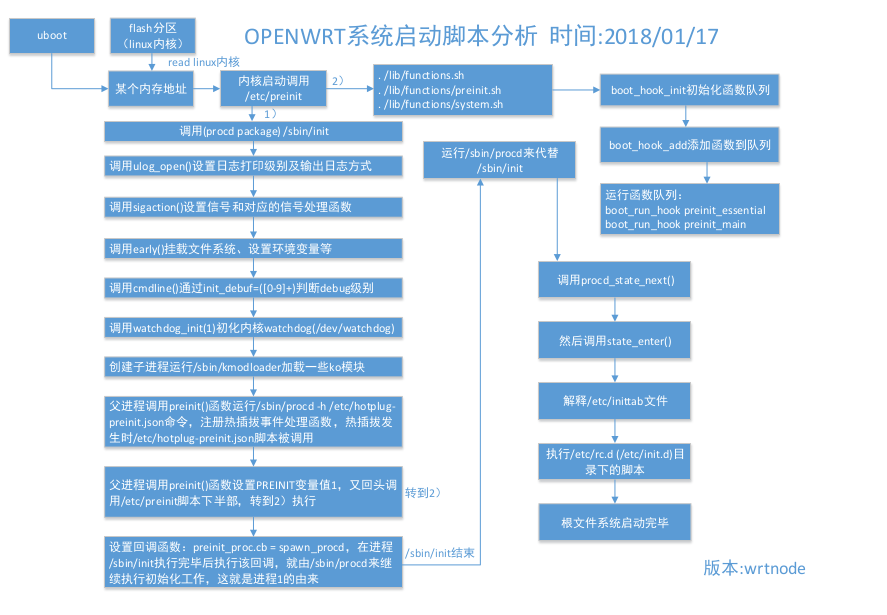

# Procd
==========================================================


* 主要功能
  * [開機時執行初始](#init)
  * [檢查config是否變化](#reload_config)
  * 維護process、接收request、增減process
  * [procd.sh](#procd_sh)

----------------------------------------------------------------------------------------------
<h3 id="init">系統開機流程</h3>
<div align=center></div>
		參考自:https://dongshao.blog.csdn.net/article/details/102767797

---------------------------------------------------------------------------------------------

### 在Init中總共創建出三支子程式執行任務 分別是 `kmodloader` `procd` `preinit.sh` 

* Kmodloader維護了一個AVL tree並執行了以下動作
  - 開啟`/proc/modules`文件中記錄已安裝的模組插入AVL tree中並設為LOADED
  - 掃描`/lib/modules/核心版本/*.ko`判斷外部模組是否在AVL中，否則加入並設為SCANNED
  - 掃描`/etc/modules-boot.d/`將數字開頭的檔案由小到大循序載入，其他設為PROBE

* 在Init中 fork出來的procd代入參數`/etc/hotplug-preinit.json`執行兩項檢測動作
  - 韌體升級uevent 執行腳本`/sbin/hotplug-call`加載`/lib/firmware`下的升級
  - 判斷uevent "SUBSYSTEM"為button，執行`/etc/rc.bottom/failsafe`建立檔案`/tmp/failsafe-button`

* preinit.sh定義了五個hook後執行`/lib/preinit/`目錄下腳本，每個腳本定義了一個function並且將其掛到五個hook上，分別是:
```bash
>#hook
>preinit_essential
>preinit_main
	>>#script
    >>define_default_set_state
    >>preinit_ip	
    >>pi_indicate_preinit
    >>do_sysinfo_generic
    >>failsafe_wait    		#判斷failsafe-button是否存在 有則設置變數FAILSAFE為真
    >>run_failsafe_hook    	#若FAILSAFE為真則執行hook failsafe
    >>indicate_regular_preinit
    >>initramfs_test
    >>do_mount_root
    >>run_init

>failsafe
    >>indicate_failsafe
    >>failsafe_netlogin
    >>failsafe_shell

>initramfs
>preinit_mount_root
```
實際上只執行`preinit_essential`和 `preinit_main`

---------------------


<h3 id="reload_config">Reload_config</h3>


<h3 id="procd_sh">Procd.sh</h3>
由於使用ubus method必須使用json格式，容易出錯，procd.sh將其封裝成函數

```bash
procd_open_trigger				#開始定義一組trigger
procd_close_trigger				#結束定義trigger
procd_add_reload_trigger		#定義關注的config，當reload_config後如果關注的檔案被修改則觸發reload_service()
```

```bash
procd_open_instance				#開始新增一個instance
procd_set_param					#設定instance參數
	-command	@啟動的命令
	-respawn	@意外結束時的重啟機制
	-env		@環境變數
	-file		@比較配置文件是否有改變
	-netdev		@綁定的網路設備
	-limits		@process的資源限制
procd_close_intsance			#結束定義instance
```


