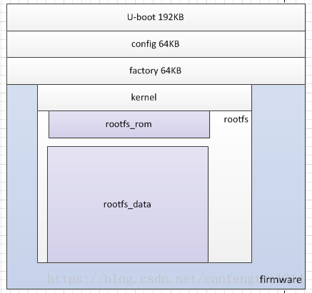

# 無法分類筆記


+  [雜記](#etc)
+  [MAC address的唯一性](#MAC_ADDR)
+  [kernel space & user space](#KS_US)
+  [Linux Bridge](#LINUX_BR)
+  [VLAN](#VLAN)
+  [Linux中的網路虛擬化](#virtual)
+  [Linux Socket](#socket)
+  [Linux根文件系統](#rootfs)

<h2 id="etc">雜記</h2>

+ Default gateway與Default route的差異

  Default Route設定於Layer3環境，而Default Gateway設定於Layer2環境，都是以Layer3的IP進行定址。

+ 私有IP位址
  10.0.0.0 - 10.255.255.255 (10/8 prefix)
  172.16.0.0 - 172.31.255.255 (172.16/12 prefix)
  192.168.0.0 - 192.168.255.255 (192.168/16 prefix)

+ Router vs Modem
  Modem 是由網絡供應商提供的調解器，其名字是由英文全名 modulator-demodulator 縮寫而成，它的作用就是把互聯網的類比訊號解為電腦讀取的數碼訊號，同樣地 Modem 也可把電腦的數碼訊號轉化為互聯網的類比訊號。簡單一點，Modem 就是把訊號不斷轉化及解碼，以乎合電腦及遠端的數據機傳輸訊息。
  Router 名為路由器，它就如一個部門主管，其主要工作就是以有線的方式，或以無線訊號（Wi-Fi）連接家中各部裝置，如電腦、電視、手機、平板電腦等，從而建立一個內聯網。

  如果以公路作為比喻，互聯網就是高速公路，Modem 就是高速公路的一個出入口，而 Router 就是通過出入口之後的網路交匯處，互聯網的訊號就是通過以上的路徑，最終去到目的地即是我們的電腦及手機等裝置。

-------------------

<h2 id="MAC_ ADDR"> MAC address的唯一性</h2>

MAC address一共占用6個bytes(48bit)，以16進制顯示，ex:
```
6e:77:0f:b8:8b:6b
```
IEEE為了保證其唯一性將前24位做為廠商標示符（Organizationally Unique Identifier，OUI），後面的24位才是序列號
<div align=center></div>

--------------------

<h2 id="KS_US"> kernel space & user space</h2>

process指令從user space切換到kernel space時會經過context switch
<div align=center></div>

現代CPU都具有不同的操作模式，不同的級別有不同的功能，其擁有資源也不盡相同，Linux在系統設計時也利用這個特性，分出了最高級(kernel)和最低級別(user)，kernel和user擁有各自的memory space，所以必須經過context switch

---------------------------

<h2 id="LINUX_BR"> Linux Bridge</h2>

>[原文](https://opengers.github.io/openstack/openstack-base-virtual-network-devices-bridge-and-vlan/#linux-bridge)

Bridge是Linux上工作在第二層的虛擬Switch，依靠軟體實現，與普通第二層功能相同。可以添加網路設備(em0,eth0,tap...)到Bridge上。在Bridge中會維護一個類似物理交換機的MAC address表，來達成數據轉發的功能。  與物理Switch不同的是，運行Bridge的Linux本身需要IP位址和其他通訊設備，但分配到bridge上的網卡是不能配置IP的(因為工作在第二層)，而 Bridge本身是可以被分配IP的，一旦被分配了IP，就意味著Bridge可以作為Router interface，如下圖。

<div align=center></div>

上圖主機中有em1、em2兩張實體網卡，bridge `br0`，VPN、虛擬機`qemu-kvm`。

1. Bridge處理封包流程
   
- 封包從外部網路(A)發往虛擬機(P2)過程，首先封包從em2(B)物理網卡進入，之後em2將封包轉發給vlan子設備em2.100，經過bridge check(L)發現子設備em2.100屬於Bridge設備，因此封包不會往上層協議發送(T)，而是進入Bridge內處理，封包從em2.100進入br0，經過`bridging decision`發現封包應該從`tap0(E)`發出，此時離開主機網路協議，發往被user process打開的設備(N)，最終qemu-kvm讀取數據。在此過程中，A發出的封包不會經過上層協議。
  
2. Bridging decision
上圖`br0`收到封包後，根據目的地MAC的不同，Bridging decision有不同的決定:
	- 目的MAC為br0本身，收到發往主機的封包，往上層送(D->J)
	- 廣播，轉送到br0上所有interface(br0,tap0,tap1,...)
	- 目的存在MAC表中，查表到對應接口(D->E)
	- 目的不存在MAC表中，flooding到所有接口(br0,tap0,tap1,...)
	- IP address不是br0,橋不處理，直接轉送給上層。

3. VLAN

   VLAN又稱虛擬網路，其原理是在第二層協議中插入額外的VLAN數據，同時保持和傳統二層設備的兼容性。VLAN設備的作用是建立一個個帶不同vlan tag的子設備，他並不能建立多個可以交換轉發數據的接口，因此需要借助bridge，把VLAN建立的子設備(eg.em2.100)橋接到br0上

----------------

<h2 id="VLAN"> VLAN</h2>

> [參考這篇](https://blog.csdn.net/zqixiao_09/article/details/79180214)
> 

根據IEEE802.1Q標準定義了VLAN HEADER格式，其在Frame header SRC Addr後，帶vlan的switch port分為兩種
1. Access port
	這些port被打上了vlan tag，離開switch的Access port的header不會有vlan tag的存在。
2. Trunk port
	在多個switch的狀況下，需要有一條線連接兩個switch，連接的port稱為trunk port，離開和進入都會保留vlan tag。
	

配置了vlan的switch比傳統switch多了以下機制:
1. MAC表格中每行有不同的VLAN ID，做比較時會拿Frame的MAC addr和VLAN ID進行比對
2. 如果沒有吻合的選項，則從所有相同VLAN ID的port和 Trunk轉發出去。

------------------------

<h2 id="virtual"> Linux中的網路虛擬化</h2>

> [這篇](https://iter01.com/512996.html)

1. Device
    在linux裡面devic(裝置)與傳統網路概念裡的物理裝置(如交換機、路由器)不同，Linux所說的裝置，其背後指的是一個類似於資料結構、核心模組或裝置驅動這樣的含義。就是說device可能只是軟體系統裡的一個驅動，一個函式介面。
    
2. Tap
    Tap位於二層資料鏈路層，tun位於三層網路層，兩者在linux裡的函式結構幾乎一致，除了一個flag值區分tap/tun。在linux中二層特指乙太網（Ethernet）(傳統網路裡二層分Ethernet,P2P,HDLC,FR,ATM)，因此有時tap也叫“虛擬以太裝置”。有意思的是linux建立tap需要用到tun模組。Linux建立tap/tun都使用tun模組。
    
#### packet based 
乙太網
|特質|方式|
|---|---|
|頻寬Bandwidth|基頻|
|網路拓樸|匯流排，星狀|
|線材|同軸電纜(10Base5,10Base2)，雙絞線(10BaseT)，光纖(10BaseF)|
|傳輸速率|10Mbps|
|偵測碰撞|CSMA/CD|
|網路型態|廣播式網路|


interface分為兩種
`physical`和`virtual`

物理interface有`eth0`、`radio0`、`wlan0`等代表實際硬體設備，如NIC、WNIC或其他Modem，一旦將設備驅動載入kernel中便會出現相應interface可供使用。
每個物理接口都是由作業系統以軟體表示命名的，以便使用者將其寫入腳本中。

virtual interface如`lo`、`eth0.1`、`vlan2`、`br0`、`tun0`...等，他們必須建立在某個物理接口之上(否則無法作用)。
|類型|表示|描述|
|---|---|----------------------|
|aliases|eth4:5|別命是一種過時的方法，用於管理每個接口多個IP address|
|VLANs|eth4.0|可以將單個layer2網路分成多個虛擬網路|
|bridges|br0|用於橋接多個虛擬或物理接口，讓它們看起來像一個接口(與VLAN相反)|
|tunnel interfaces|pppoe-dsl、tun0|用於更改傳出網絡數據包或傳入網絡數據包的順序|
|wireless vif|wlan0|WNIC物理網路接口|

兩個interface也可以綁在一起(bonded)

--------------

<h2 id="socket"> LINUX SOCKET</h2>

socket是常見的一種process之間的溝通方式（IPC），socket通訊分兩種：
+ Internet domain socket

	- 這種用於不同主機間的通訊。socket只要知道了對方的IP和port就可以溝通了，所以這種socket是建立在網路protocol之上的。
+ Unix domain socket

	- 這種用於一台主機的process之間溝通，不需要建立在網絡protocol之上，主要是基於file system而發展的。與Internet domain socket不一樣的是，Unix domain socket需要知道的是process之間需要基於哪一個文件（相同的文件路徑）來通訊。
+ 實現一個server步驟為：
    + 創建一個socket
    + 將socket綁訂到某個地址
    + 讓socket轉換成被動模式
    + 接受請求

###　創建一個socket
```C
#include <sys/types.h>
#include <sys/socket.h>
int socket(int domain, int type, int protocol);
```
`domain`：表示通訊在甚麼範圍內作用，不同域的通訊協定是不同的，Unix之多種類的通訊域，其中AF_UNIX（本機通訊）、AF_INET（IP4通訊）、AF_INET6（IP6通訊）最為常見


-------

<h2 id="rootfs">LINUX Root file system</h2>

> [參考1](https://blog.csdn.net/LEON1741/article/details/78159754)
> [參考2](https://fjkfwz.github.io/2014/12/04/Openwrt-File-System/)
> 

根文件系統是kernel啟動時mount的第一個文件系統，kernel code和image保存在rootfs中，系統引導啟動程式會在根文件系統mount後將依些基本的初始化腳本和服務load到memory中運行
根目錄是整個文件系統的根，如果沒有根，其他文件系統也沒辦法進行加載的，其包含了:

1. init process必須運行在rootfs上
2. 提供根目錄 `/`
3. mount分區時所依賴的訊息存放在/etc/fstab中
4. shell命令必須運行在根文件系統上 如ls、cd

 Linux啟動時，第一必須掛載的是根文件系統，若系統不能從指定設備上掛載根文件系統，則會出錯而退出啟動，成功之後可以自動或手動掛載其他文件系統

 ### Openwrt filesystem

 在openwrt中，將內部儲存系統分為`rootfs`、`rootfs_data`，合併在一起成為一個可寫的overlay filesystem

 由於嵌入式系統的flash容量很小，沒有調整的必要，分割槽都是固定的
<div align=center></div>

1. kernel啟動完成後，由kernel載入rootfs_rom read only來完成系統初步啟動
2. rootfs_rom採用linux kernel支援的squashFS(read only file system)並掛載到`/rom`
3. 系統將使用JFFS2檔案系統格式化rootfs_data分區並掛載到`/overlay`目錄
4. 將`/overlay`透明掛載為`/`
5. 將一部分記憶體掛載為`/tmp`
