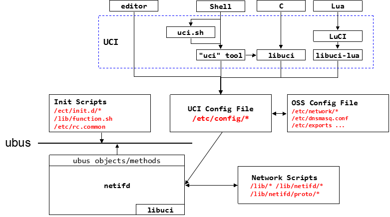

# Network (/etc/config/network)

---------------------------

> 本文摘自 https://openwrt.org/docs/guide-user/base-system/basic-networking 並省略了一些細節
> 
+ Netifd設計
	- [Netifd consist](#consist)
	- [Config reload](#CF_reload)
	- [Netifd - Device](#Dev)
	- [Netifd - Interface](#itf)
+ Netifd配置參數
	- [Netifd - interface setting](#inter_set)
	- [Netifd - protocol setting](#proto_feild)
+ 問題清單
	- [Default config是怎麼生成的?](#Def_C)
	- Device與Interface之間的差別?
	- Config如何改變且在何時何處reload?
	- Device和Interface的state machine?
-----------------------------------------------
<h2 id="consist">Netifd consist</h2>

+ Shell腳本 `/sbin/ifup`、`/sbin/ifdown`、`/sbin/ifstatus`、`/sbin/devstatus` 
+ init.d腳本 `/etc/init.d/network`
+ hotplug腳本 `/etc/hotplug.d/iface/00-netstate`、` /etc/hotplug.d/iface/10-sysctl`
+ udhcpc `/usr/share/udhcpc/default.script`
+ netifd deamon `/sbin/netifd`

<div align=center></div>

--------------
<h2 id="CF_reload">Config reload</h2>

UCI將config儲存在`/etc/config`下，而network這個uci子系統負責定義`switch VLANS` `interface configurations` 和 `network routes` 

在修改network設定後 必須經由守護進程`netifd`重新載入
```bash
service network reload
```
或是藉由啟動腳本重新載入
```bash
/etc/init.d/network reload
```


<h2 id="Dev">Device</h2>

在`netifd`中定義了三個level:`Device`、 `interface`、 `proto handler` 

而作為一個路由器使用者我們只需關心配置Interface層，創建一個Interface並指名其依賴的Device，及綁定上網方式(proto handler)，就完成網路設定可以開始工作，當網路狀態發生改變時，三者也能互相通知。

`Device`代表物理接口(eg.eth0)或是虛擬連結(eg. VPN links or tunnels)，每個`Device`至少會綁定一個`Device_user`，當最後一個user被刪除時，Device也會跟著被刪除。Device亦可引用其他Device(用於管理不特定的Device，eg.網橋、vlan)。

Device依照up/down進行refcounter管理。調用`claim_device()`

已註冊的Device可能無法立即的被使用，Device的state轉換將會通過以下事件類型告知所有device_user:
|EVENT|DESCRIPTION|
|---|----------------|
|DEV_EVENT_ADD|Device現在已存在系統中，如果已經有device_user就會立刻發送事件|
|DEV_EVENT_REMOVE|這個設備不再可用，所有的device_user必須刪除其引用|
|DEV_EVENT_SETUP|設備即將被啟動，Users可設定一些必要的配置參數，但並非所有時候都會產生這個EVENT|
|DEV_EVENT_UP|設備已經啟動|
|DEV_EVENT_TEARDOWN|設備即將被關閉|
|DEV_EVENT_DOWN|設備已被關閉|

----------------
<h2 id="itf">Interface</h2>

+ 配置一個Interface通常要完成下列工作
	1. MAC address、MTU、協商速率等Layer 2屬性
	2. IP address、Route等Layer3屬性
	3. 設定完成後可能需要更新的Layer3屬性。如static、DHCP、PPPoE等。

`Interface`表示一個高級配置應用於一個或多個`Device`上。Interface必須被配置到一個主要Device上。在Default下，Layer3設備只需要被映射到簡單配置的protocol上，例如: static、DHCP等，更複雜的protocol，如pptp或VPN才需要新映射到外部模組上。

Interface state訊息如下:
|EVENT|DESCRIPTION|
|---|----------------|
|IFS_SETUP|此interface正在被proto handler配置中|
|IFS_UP|Interface成功被配置|
|IFS_TEARDOWN|interface準備取消配置|
|IFS_DOWN|interfac已取消配置|


----------------
<h2 id="inter_set">Interface setting</h2>
在UCI下顯示:

```
network.lan=interface
network.lan.type='bridge'
network.lan.ifname='eth0.1'
network.lan.proto='static'
network.lan.netmask='255.255.255.0'
network.lan.ip6assign='60'
network.lan.ipaddr='192.168.1.1'
```
在Config File裡:

```
config interface 'lan'
        option type 'bridge'
        option ifname 'eth0.1'
        option proto 'static'
        option netmask '255.255.255.0'
        option ip6assign '60'
        option ipaddr '192.168.1.1'
```

* Netifd透過讀取以上config創建實例，並套用設定，如果指定的依賴設備不存在(ifname)，則透過此配置中device相關欄位創建新的device。
* 不同於Device，proto必須在Netifd啟動時就預先定義好，config中的proto欄位必須是已經存在的proto handler名稱。
* 實際上一個最小的interface定義只需如下:

```
config 'interface' 'wan'
        option 'proto' 'dhcp'
        option 'ifname' 'eth0.2'
```
-------------
<h2 id="proto_feild">Proto欄位選項</h2>

| Proto | Description |
| :--- | :---------- |
|static | 固定的位址和網路遮罩 |
|dhcp|動態主機設定協議|
|dhcpv6|IPv6的動態主機設定協議|
|ppp|點等協定|
|pppoe|乙太網路中封裝PPP|
|pppoa|非同步對等協定|
|3g|第三代行動通訊協定|
|...|etc|
|none|未指定的protocol 忽略其他的interface設定，相當於disable|


根據interface protocol，可能還需要聲明以下參數

| name | type | Default | Description |
| ---- | ---- | ---- | ---- |
|ifname|interface name|none|如果設置為bridge 則此欄位為list，WLAN interface是動態或不可預測的，因此建議在無線配置中分配給bridge|
|types|string|none| |
| stp |bool|0|bridge限定，啟動Spanning Tree Protocol|
|bridge_empty|bool|0|bridge限定，創建空的橋接器|
|igmp_snooping|bool|0|bridge限定，multicast_snooping kernel setting |
|multicast_querier|bool|看igmp|bridge限定，multicast_querier  kernel setting|
|macaddr|mac addr|none|覆寫mac address|
|mtu|number|none|覆寫MTU|
|auto|bool|proto為none時0，其他1|指定是否在啟動時創建interface|
|ipv6|bool|1|是否套用ipv6|

-------------
## 問題清單

<h3 id="Def_C">Default Config是如何生成的?</h2>

Ans: `/lib/functions/uci-default.sh`會生成default的config，且同資料夾下的腳本為其library。
```bash
root@LEDE:~# ls /lib/functions/
fsck             network.sh       procd.sh         system.sh
leds.sh          preinit.sh       service.sh       uci-defaults.sh
```


