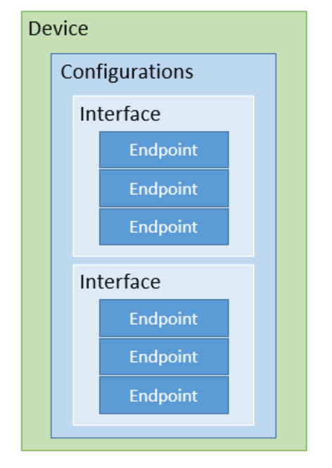
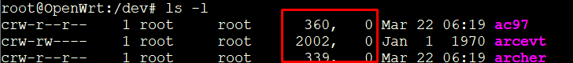
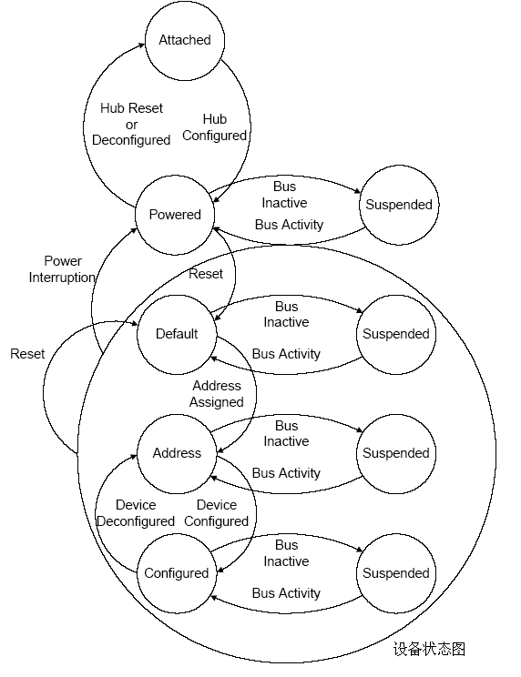
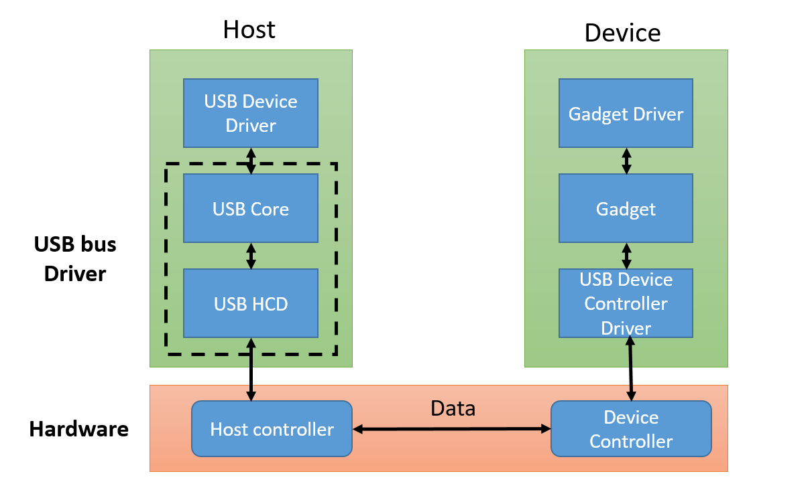
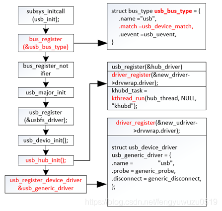
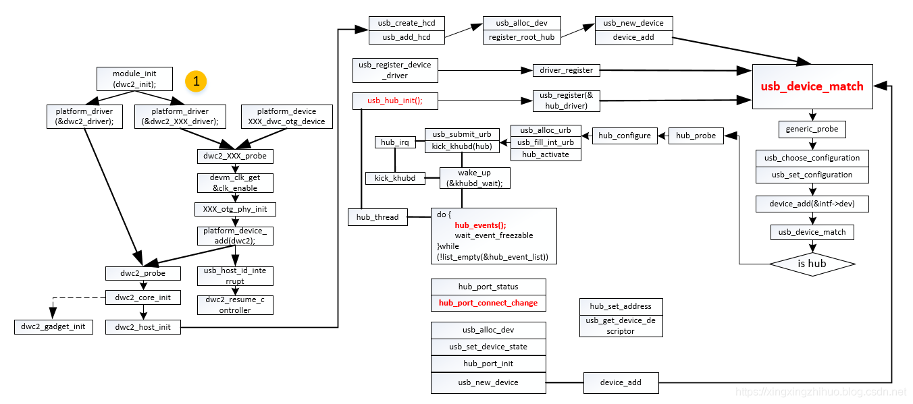

# USB(Universal Serial Bus)

+ [Overview](#overview)
+ [前置知識](#background)
	- [驅動基礎知識](#basicdriver)
+ [USB子系統架構](#arch)
	- [USB基礎知識](#usbbasic)
	- [USB的組成](#consist)
	- [USB設備偵測](#detect)
+ [USB子系統驅動](#driverframe)

---

<h1 id="background">0、前置知識</h1>

將可移動設備插入系統時，kernel檢測到新的硬體插入，然後分別通知`hotplug`和`udev`，hotplug用來載入相關的kernel module，而udev用來在/dev目錄下創建相應的設備節點，如/dev/sda1。
udev和hotplug在完成工作之後會將消息通知hal的daemon(hald)。
hald在收到兩者的消息之後，認為新設備已被系統認可，此時會透過一系列的規則文件(xxx-policy.fdi)，把發現新硬體的消息透過dbus發送出去，同時還會更新/etc/fstab，為相應的device創建更合適的掛載點。

<h2 id="hotplug">Hotplug</h2>
hotplug package和kernel中的hotplug模組是不同的東西，hotplug package是用來處理kernel產生的kernel event，還用來引導檢測硬體並載入相關kernel module

`/etc/hotplug/*.rc`:用於coldplug，也就是偵測系統啟動前就存在的硬體。
`/etc/hotplug/*.agent`: 這些腳本會被hotplug調用來回應不同的事件，導致插入相應的kernel module和user預定義的腳本
`/sbin/hotplug`:

<h2 id="basicdriver">0.1、Driver</h2>

設備驅動程式(Device Driver)，是一個允許應用軟體與硬體互動的程式，這個程式建立了一個硬體與硬體，或硬體與軟體溝通的介面(interface)。CPU經由主機板上的總線(BUS)或其他溝通子系統(subsystem)與硬體形成連接，這樣的連接使得硬體之間交換數據成為可能。

> 驅動程式是提供硬體到操作的一個接口，並且協調兩者之間的關係

電腦系統只要硬體由CPU、儲存器(內部和外部)、外部設備組成。驅動的對象一般是儲存器和外部設備，Linux將這些設備分成3大類
1. 字符設備(char):指那些能一個byte一個byte讀取的設備，如LED、鍵盤、滑鼠..等，這種設備通常要在驅動層實現open()、close()、write()、read()、ioctl()等函數，這些函數最終會被filesystem中的相關函數調用，kernel會為這種設備建立一個對應文件。
2. 塊設備(block):指那些能夠被一個固定大小寫入並且能在隨機位置讀取固定大小資料的設備，如硬碟
3. 網路設備(Network):負責主機之間的數據交換

<h2 id="temp">0.1、temp</h2>

Linux設備模型中最重要的是的三個概念:`bus`、`device`、`driver`，而kernel中也為他們定義了結構體，struct bus_type、struct device、struct device_driver，他們都來自include/linux/device.h。
Bus有很多種，如PCI、SCSI、USB，這裡我們只需要知道，struct bus_type中有兩個重要的成員:`struct kset drivers`、`struct kset device`
struct bus_type與drivers和devices的兩個表聯繫了起來，也就是說知道了bus的結構，就能夠找到bus上所有的設備，以及支援的drivers，而將其建立綁定的工作，是由USB Core完成的。
為了實現這個目的，每次出現一個設備就要向bus註冊，每次出現一個新驅動也要向bus註冊，並插入相應link list，如此一來，bus就可以找到所有的device和driver。

一個設備只能綁定一個驅動，但驅動並非只能綁定一個設備，id_table由driver提供，裡面註明了該driver支援那些設備，如果設備屬於這張表，將其綁定。Device則會維護一個結構，這個結構紀錄了該裝置的基本訊息，跟id table來比對，必須要高度符合才會進行綁定。

每個設備對應一個struct device，但是有各是各樣的設備，我們分得細一點，針對USB設備，設計了一個usb_device的結構體。

------

<h1 id="arch">1、USB子系統</h1>

<h2 id="usbbasic">1.1、USB基礎知識</h2>

USB支援設備即插即用的hotplug功能，在1994年由intel、IBM、Microsoft等公司提出，在此之前PC接口雜亂，擴展能力差，USB正是為了解決此問題出現。

<h2 id="consist">1.2、USB設備組成</h2>

+ Configurations: 一次只能使用一種模式，不可能同時有兩種模式並行的運作狀態，常見的應用是將 USB 裝置切換至 Firmware 的更新模式，做韌體升級，此時該硬體的一般模式將沒有作用。
+ Interface:一個 USB 裝置可能有很多個輸入或輸出介面，舉例來說，若是有一個帶麥克風的耳機，就會有兩個介面，分別為『聲音 Input』和『聲音 Output』所使用。
+ Endpoint:USB Device 真正和 Host 間傳輸資料是透過『Endpoint』，等到 USB Device 初始化完，剩下的就是使用 Endpoint 與 USB Device 溝通

在USB協議中，Interface代表一個基本的功能，一個複雜的USB可以具備多個interface。
一個USB設備，兩種功能，一個鍵盤上面帶一個喇叭，共兩個interface，應該要對應兩個驅動，一個鍵盤驅動，一個音頻驅動，但常常是將這樣稱為一個設備。

配置`configuration`和設置`setting`是兩個不同的東西。
先說配置，一個手機可以有多個配置，如相機模式，或者接在電腦上當一個隨身碟，這兩種模式就是不同的配置，你選擇其中一個模式時不能訪問另外一個。一個配置代表著不同的功能，也就是需要用到不同的interface。
再來說設置，一個手機可能配置確定了，震動還是鈴聲確定了，各種功能都確定了，但還是可以調整音量大小，這個就是設置。

在linux中，所有的硬體皆是以文件表示，而表示設備的設備文件會有一個主設備號和次設備號

主設備號表明了設備的種類，也表明設備對應哪個驅動，而次設備號則是因為一個驅動要支持多個設備而讓驅動區分他們而設置的。也就是說主設備號用來找到對應的驅動，而次設備號則是讓驅動來決定要對哪個設備進行操作。
主設備號在linux中已經有部分作為固定的存在被分配掉了，在`Documentation/devices.txt`列出，必須從剩餘的數字去挑選，也可以交給系統決定。

<h2 id="detect">1.3、USB設備的偵測</h2>

<h3 id="enum">1.3.1、枚舉</h3>

`enumerate`:在這邊是指從設備讀取一些訊息，包括知道是怎麼樣的設備，以及如何通訊，這樣主機就可以根據這些訊息來載入合適的驅動。

USB架構中，hub負責檢測設備的連接和斷開。在系統啟動時，主機以polling的方式詢問root hub是否有新的設備連接，一旦有新設備連接上，host就會發送一系列的requests給設備所掛載到的hub上，再由hub建立起一條host與device之間通訊的通道，然後主機以控制傳輸的方式對endpoint0發送各種請求進行枚舉操作。

<h3 id="state">1.3.2、設備狀態</h3>

1. `Attached`設備連接到USB插孔上
2. `Powered`:設備的電源可以來自外部，也可以由hub提供
3. `Default`:設備通電後，還不會回應任何bus處理，直到bus接收復位訊號為止。收到訊號後，可以用default的address找設備
4. `Address`:在復位後主機會分配一個唯一的address給設備，當設備處於suspended狀態時這個address都不會改變
5. `Configured`:在USB設備正常工作之前，必須被正確的設定
6. `Suspended`:設備在沒有與bus傳輸時，為了省電，會將設備暫時掛起。

<h2 id="enumproc">1.2、USB枚舉過程</h2>

1. 用戶把USB設備插入端口 : 這時設備處於加電狀態，端口是無效的
2. Hub監測端口上的電壓 : 設備接口上會有一個上拉電組，當插入時，hub會偵測到電壓上升，便認為有設備插入，並且透過D+、D-來判斷是全速還低速設備
3. Host了解連接的設備 : hub向主機報告端口的狀態，此時設備還不可見，如果連接/斷開事件被告知，host會再發送request詢問此次事件詳情
4. hub接到request後回復host這個設備是高速還是低速的
5. host等待上電完成後，會發出復位請求，使該設備的D+、D-回到低電平
6. host檢測全速設備是否能支持高速模式
7. Hub建立與主機之間的訊息通道 : host會不斷詢問復位是否成功，當成功時轉回default state，address為0，host可以透過這個address和endpoint0通訊
8. host請求取得Descriptor : 在這次請求中host只關心descriptor的訊息長度，其他並不在乎。
9. host分配新的address給device
10. host再度請求Descriptor : 這次請求中，host會先請求新地址的Device descriptor了解支援的配置個數，設備類型，VID，PID。然後依序讀取Configuration Descriptor、字符串等，逐一了解設備更詳細的訊息
11. 主機通過對descriptor的了解，選擇最合適的driver給設備，然後宣告設備已找到，後調用設備模型提供的interface，將設備加到usb bus的設備列表中，然後bus會找驅動列表中的所有驅動哪個跟裝置最合適，之後交給驅動處理。

<h1 id="driverframe">2、USB子系統驅動架構</h1>

USB總線驅動框架總結如下圖:

<h2 id="usbcore">2.1、USB Core</h2>

USB core這個模組為純軟體，他並不代表一個設備，是獨立於硬體的protocol stack，是所有USB設備賴以生存的模組，及USB子系統核心。code在kernel/drivers/usb/core底下

USB core為設備驅動提供服務，一個用於訪問和控制硬體的interface，而不用考慮底層是哪種controller。Core將request mapping到相關的HCD，用戶不能也不需要直接訪問HCD，只需要呼叫Core提供的interface，Core就是HCD與USB設備的橋樑。

Linux在啟動階段，透過subsys_initcall會完成USB Core的載入

usb_init主要完成初始化相關工作:
+ 透過bus_register註冊usb_bus_type(裡面包含了兩個klist，一個為設備，一個為驅動)
+ 完成hub的初始化:向bus添加hub驅動，並且建立thread來監控hub是否有USB設備的插入
+ 向bus註冊usb_generic_driver，用於插入後的枚舉

<h2 id="hcd">2.2、USB HCD</h2>

全名`Host Controller Driver`，在硬體host控制器之上運行，是對主機硬體的一個抽象，實現kernel與controller之間的對話接口，會包含多種USB interface標準:

1. `OHCI`（Open Host Controller Interface）是支援USB1.1的標準，但它不僅僅是針對USB，還支援其他的一些介面，比如它還支援Apple的火線（Firewire，IEEE 1394）介面。與UHCI相比，OHCI的硬體複雜，硬體做的事情更多，所以實現對應的軟體驅動的任務，就相對較簡單。主要用於非x86的USB，如擴展卡、嵌入式開發板的USB主控。
2. `UHCI`（Universal Host Controller Interface），是Intel主導的對USB1.0、1.1的介面標準，與OHCI不相容。UHCI的軟體驅動的任務重，需要做得比較複雜，但可以使用較便宜、較簡單的硬體的USB控制器。Intel和VIA使用UHCI，而其餘的硬體提供商使用OHCI。
3. `EHCI`（Enhanced Host Controller Interface），是Intel主導的USB2.0的介面標準。EHCI僅提供USB2.0的高速功能，而依靠UHCI或OHCI來提供對全速（full-speed）或低速（low-speed）設備的支援。
4. `xHCI`（eXtensible Host Controller Interface），是最新最火的USB3.0的介面標準，它在速度、節能、虛擬化等方面都比前面3中有了較大的提高。xHCI 支援所有種類速度的USB設備（USB 3.0 SuperSpeed, USB 2.0 High-speed, USB 1.1 Low-speed and Full-speed）。

HCD主要完成的任務有:
+ 完成硬體的初始化，使其在主狀態下
+ 以軟體的方式構建出controller的結構體，並提供控制器操作函數，用於數據交換
+ 創建USB設備來表示root hub
+ 對root hub的監控

<h3 id="dd">USB Device Driver</h3>

USB Device是由一些`Configuration`、`Interface`、`Endpoint`組成，亦即一個USB device可以含有一個或多個interface，每個interface含有多個endpoint。一個子驅動對應一個interface而非整個device

----------

<h1 id="kmod">kernel module</h1>

`kmod-usb-core`
`kmod-usb-storage`:必須的，支援USB儲存
`kmod-usb-storage-extras`(option) kernel支持更多驅動程式，eg.SmartMedia讀卡

`kmod-usb-ohci`支援USB1.1
`kmod-usb2`or `kmod-usb-ehci`支援USB2.0
`kmod-usb3`:支援USB3.0

`kmod-scsi-core`任何大容量儲存都是通用SCSI設備
`block-mount`如果使用fstab UCI配置或LUCI安裝，用於安裝和檢查block(file system的交換)和hot-plug(插入設備時偵測)腳本

### 文件系統
`kmod-fs-ext4`、`kmod-fs-ext3`Linux系統支持，但windows不支持
`kmod-fs-vfat`FAT32格式，Linux和window支持但格式僅支持32GB的最大分區和4GB的單檔寫入
`kmod-fs-ntfs`NTFS格式的USB是最廣泛的一種，支持文件最大可擴展為256TB
`ntfs-3g`如果選擇kmod-fs-ntfs掛載會變成read only，兩個都選mount時需要-t ntfs-3g指定，否則會預設ntfs read only。

-------------

